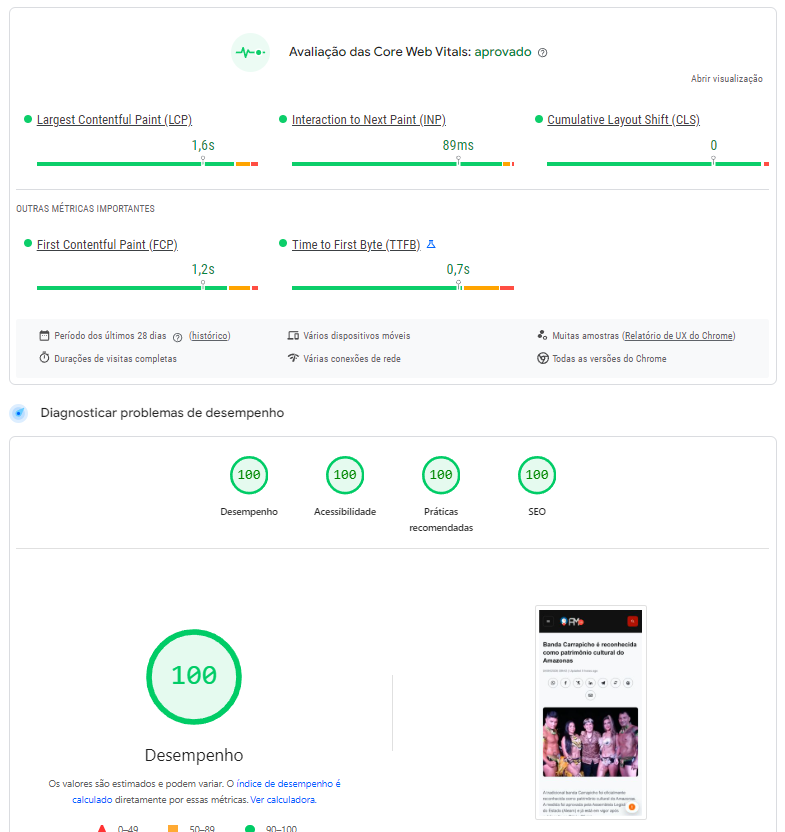

# Portal AM24h Theme

Production-grade WordPress news/editorial theme focused on Core Web Vitals, efficient asset delivery, secure settings flows, and maintainable modular architecture.

## Technical Positioning

Portal AM24h is intentionally built for teams that value measurable frontend performance and conservative engineering decisions over framework-heavy complexity.

The project emphasizes:

- Fast first render and stable layout behavior.
- WordPress-native APIs and compatibility.
- Strong sanitization/escaping boundaries.
- Small, purpose-specific modules instead of monolithic theme files.
- Low dependency surface (vanilla JavaScript, no jQuery requirement).

## Highlights

- Modular bootstrap architecture in [includes/Core/Bootstrap.php](includes/Core/Bootstrap.php).
- Bounded critical CSS inlining in [includes/Performance/CriticalCss.php](includes/Performance/CriticalCss.php).
- Non-critical stylesheet orchestration in [includes/Performance/HeadStyles.php](includes/Performance/HeadStyles.php).
- Theme-scoped script/style URL filtering in [includes/Core/Assets.php](includes/Core/Assets.php).
- Third-party script isolation path (worker-friendly vs main-thread) in [includes/Front/ThirdPartyScripts.php](includes/Front/ThirdPartyScripts.php).
- Dedicated sanitization layer in [includes/Admin/SettingsSanitizer.php](includes/Admin/SettingsSanitizer.php).
- Local typography pipeline (validation/download/storage/registry/font-face generation).

## Architecture Overview

Runtime flow:

1. [functions.php](functions.php) loads [includes/Core/Bootstrap.php](includes/Core/Bootstrap.php).
2. Bootstrap creates shared services and feature modules.
3. Every module registers only its own hooks via register_hooks().

Domain boundaries:

- Core: lifecycle, theme supports, frontend asset wiring.
- Performance: critical CSS, head style strategy, cleanup controls.
- Admin: settings API integration and sanitization.
- Front: cookie banner, accessibility popup, third-party scripts, custom CSS.
- Typography: local font pipeline.
- Content: excerpt and featured-image behavior.
- Support: repositories and shared utility helpers.

See [docs/ARCHITECTURE.md](docs/ARCHITECTURE.md).

## Performance Strategy

This theme prioritizes practical performance controls that are understandable and maintainable in production:

- Inline only a bounded critical CSS payload for early paint.
- Load non-critical styles as cacheable assets.
- Keep JS feature-scoped and defer execution when appropriate.
- Use on-demand block-style cleanup toggles instead of hard-coded removals.
- Treat third-party scripts as an explicit performance and risk boundary.

See [docs/PERFORMANCE.md](docs/PERFORMANCE.md).

## Security Practices

- Sanitization on write through [includes/Admin/SettingsSanitizer.php](includes/Admin/SettingsSanitizer.php).
- Validation/normalization on read in [includes/Support/ThemeOptionsRepository.php](includes/Support/ThemeOptionsRepository.php).
- Context-aware escaping in templates and admin rendering.
- Nonce/capability checks in privileged admin actions.
- Controlled URL handling for external script and asset flows.

See [docs/SECURITY.md](docs/SECURITY.md).

## WordPress Best Practices Applied

- Theme supports: title-tag, post-thumbnails, align-wide, responsive-embeds, editor-styles, html5, selective refresh.
- Purposeful image sizes for editorial cards and single post hero images.
- Featured image loading priority on single posts to improve LCP behavior.
- Translation-ready with text domain am24h and language catalog constraints.

## Feature Set

- Optional cookie consent banner.
- Optional accessibility popup with persisted user preferences.
- Configurable single-post share bar (networks, order, icon source).
- Third-party script manager with Partytown support and safe fallback.
- Local typography manager for deterministic font delivery.

## Stack

- PHP (WordPress theme architecture).
- Vanilla JavaScript (no framework runtime dependency).
- CSS with critical/non-critical split.
- Composer for coding standards workflow.

## Local Setup

1. Place the theme in wp-content/themes/portal-am24h.
2. Activate it in WordPress admin.
3. Configure options from the Portal AM24h settings pages.
4. Install dev tooling:

```bash
composer install
composer run lint:phpcs
composer run lint:phpcs-full
composer run lint:phpcbf
```

See [docs/DEVELOPMENT_NOTES.md](docs/DEVELOPMENT_NOTES.md).

## Project Structure

Core directories:

- [includes/Core](includes/Core)
- [includes/Performance](includes/Performance)
- [includes/Admin](includes/Admin)
- [includes/Front](includes/Front)
- [includes/Typography](includes/Typography)
- [includes/Content](includes/Content)
- [includes/Support](includes/Support)
- [assets](assets)
- [docs](docs)

## Optimization Rationale

Key engineering choices and why they exist:

- No jQuery/frontend framework dependency: lower payload and fewer upgrade risks.
- Bounded critical CSS: prevents accidental head bloat.
- Worker-vs-main-thread script split: explicit integration risk management.
- Theme-scoped asset URL filtering: avoids breaking plugin-managed assets.
- Default options seeded from a single source of truth: reduces configuration drift.

## Performance Evidence

The repository includes a real Google PageSpeed Insights screenshot for the portalam24h.com implementation, showing the measured result in that execution context.

Evidence image:

- [docs/images/score-portalam24h.png](docs/images/score-portalam24h.png)

Rendered in this README:



Important:

- This is visual evidence of a real execution in a specific scenario.
- It is not a promise of identical results across every environment.
- Lighthouse/Core Web Vitals outcomes vary by hosting, content mix, plugins, cache/CDN setup, geography, device profile, and test methodology.

## Screenshots

- Add frontend screenshots under [docs/images](docs/images) to document UI and layout behavior across breakpoints.

## Known Tradeoffs

- Aggressive cleanup toggles may affect plugin assumptions.
- Some third-party integrations must remain on the main thread.
- Performance scores are environment-dependent by nature.

## Suggested GitHub Identity

Short description:

- Production-grade WordPress editorial theme optimized for Core Web Vitals, secure settings flows, and maintainable modular architecture.

Technical subtitle:

- WordPress Theme Engineering: Core Web Vitals, deterministic asset delivery, and secure modular architecture for production news platforms.

Suggested topics:

- wordpress
- wordpress-theme
- gutenberg
- performance
- core-web-vitals
- lighthouse
- php
- frontend-performance
- technical-seo
- web-performance

## License

GPL-2.0-or-later.
